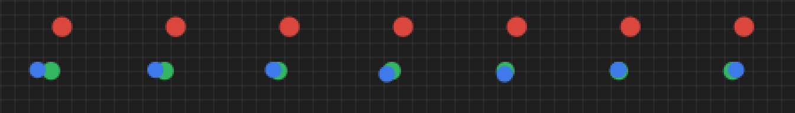

# MiniWorld

一个玩具规模的世界模型对比实验台。在同一套动作条件轨迹上，把三类世界模型放在完全相同的数据和评测协议下比较：

| 模型 | 预测什么 | 训练时看像素吗 | 想象时怎么走 |
|---|---|---|---|
| **PixelWM** | `x_{t+1}` | 是，MSE | 把预测帧再喂回去 |
| **RSSM** | `h_t, z_t`，再解码 `x_t, r_t` | 是，重构 + KL + 奖励 | 用先验 `p(z\|h)` 闭环 |
| **JEPA** | `s_{t+1}`（表征） | 否 | 把预测向量再喂给 predictor |

目标不是复现 SOTA，而是把三条技术路线在**损失函数和接口**上的真实差别做成可测量、可复现的对比——规模小到能在 CPU 上跑完，每一项损失都能手推。

在此基础上还有三个后续实验，分别针对规划、离散化表征和数据采集，见文末。

## 环境

`PushArena`：64×64 RGB。蓝色运动学 agent 把红色动态球推向绿色目标。地板网格是刻意加入的视觉噪声——像素损失必须为它付出容量。



数据：120 局 × 64 步，以 ε=0.35 的概率走「朝球走」启发式、否则均匀随机，保证碰撞事件真的发生（这个 ε 的影响后面单独做了消融）。

## 运行

```bash
pip install -r requirements.txt
python run_all.py 800          # 采集 + 三模型训练 + 评估
```

产物：

- `checkpoints/{pixel,rssm,jepa}.pt`
- `results/metrics.json` — 下方所有数字均来自这里
- `results/rollout_strip.png` — 上 GT / 中 Pixel / 下 RSSM

一次完整运行的要点（CPU，1000 step）：

- Pixel 前景 MSE 1→5 步：0.034 → 0.145（开环复合）
- RSSM 前景 MSE 1→5 步：0.049 → 0.052（长程持平，但画面更糊）
- JEPA 球 x/y 线性探针 R²：0.63 / 0.79
- CEM 规划未超过随机；noop 消融几乎持平

## 评估协议

1. **开环像素 MSE @ 1/5/10 步**（JEPA 没有像素，跳过）
2. **同一 JEPA target encoder 下的表征余弦** — 把三条路线放进同一个空间比较
3. **动作消融**：eval 时把动作换成 noop，若模型真条件于动作，误差应显著变差
4. **CEM 规划成功率**：在模型里搜索动作序列，拿到真环境执行。JEPA 的目标是「球已在目标上」的 goal image 表征，对应 V-JEPA 2-AC 的协议

## 代码

- `env.py` 环境与数据采集
- `models.py` PixelWM / RSSM / JEPA
- `train.py` 训练循环
- `eval.py` 评测表格与规划

RSSM 按 Dreamer 的写法：

```
h_t = GRU(h_{t-1}, [z_{t-1}, a_{t-1}])
z_t ~ q(z_t | h_t, e_t)          # 观察（后验）
z_t ~ p(z_t | h_t)               # 想象（先验）
L = recon + 0.1 reward + 0.1 KL_balance(α=0.8, free-nats=0.5)
```

JEPA：EMA target encoder + `1 - cosine` + 方差铰链（防坍缩）。

## 训练中遇到的问题与修正

第一版用全局 MSE，结果 Pixel 和 RSSM 都只重构了地板网格，物体几乎不可见。原因是物体仅占约 6% 的像素，损失被背景主导——这是「像素似然把容量花在纹理上」的一个微型复现。

修正：改用前景加权重构损失。评测也相应调整为看 `fg_mse`、noop 消融、以及 JEPA embedding 对球位置的线性探针，而不是把「画面好不好看」当成世界模型的评价标准。

## 已知限制

- 随机潜变量是高斯的，不是 DreamerV2 的离散 categorical
- 没有 actor-critic，规划用 CEM，不是想象中的 RL
- CPU、小网络、玩具物理，数字不能外推到 Genie / Cosmos 这类规模
- 结论的适用范围仅限于「三条路线在损失和接口上的差别」，不构成对各自方法上限的评价

---

## 后续实验一：`state_planning.py` — 规划失败源于感知还是规划本身

上面的 CEM 在像素/latent 空间里从未赢过随机，但无法区分是「模型不准」还是「规划方法本身有问题」。这个脚本把两个变量拆开：不再从图像估计状态，直接用环境真实状态（agent/球/目标位置 + 球速度，8 维）训一个 MLP 动力学模型，CEM 的 reward 也换成环境自身的真实距离函数。

```
python state_planning.py
```

结果（`results/state_planning.json`）：

- 动力学模型比像素版准一个量级：1 步 state-MSE 0.032，10 步 2.83
- 但仅以「球到目标距离」为 reward 时，agent 离球较远的每条想象轨迹中球都不会移动——reward 没有梯度，CEM 无从优化：成功率 5%，低于只朝球走、完全不知道目标位置的启发式基线（35%）
- 加入「靠近球给奖励」的 shaping 项后成功率升至 15%，验证了上述诊断，但仍未超过启发式
- 开环规划（一次性搜完整局再执行）仅 10%：48 个样本无法搜索 5^40 的动作空间，MPC 每步用真实状态重规划是结构性必需

结论：动力学模型准确不代表规划有效。reward 设计（尤其是稀疏的接触型 reward）和搜索预算，是与感知完全独立的失效维度。

## 后续实验二：`vqvae_tokenizer.py` — codebook 坍缩的复现与修复

Genie / VQGAN 这类世界模型先把帧离散化成 token 再预测 token 序列。这个脚本在同一批 PushArena 帧上训练 48 码本的 Conv VQ-VAE，对照两种训练策略：

- **naive**：VQ-VAE-1 的 commitment + codebook loss，直接梯度回传
- **ema**：VQ-VAE-2 的 EMA 码本更新，外加死码用当前 batch 的编码重新初始化

```
python vqvae_tokenizer.py
```

结果（`results/vqvae.json`，`results/vqvae_recon_strip.png`）：

- naive：48 个码仅 7 个被使用，其中单个码占据 83.7% 的使用量（perplexity 2.0，等效于只有约 2 个码在工作）
- ema：48 个码全部激活（perplexity 21.0，top-1 码占比降至 21.8%）
- 重构前景加权 MSE 从 0.022 降至 0.011——码本坍缩不只是使用率问题，它实际损失了重构能力

## 后续实验三：`data_collection.py` — 采集策略如何决定模型是否学会使用动作

采集器带一个参数 `ε`：以概率 ε 执行「朝球走」的启发式动作，否则均匀随机。ε 从 0 扫到 1，等价于从纯随机探索扫到纯专家演示。每个配置采集同样多的数据（7680 条转移）、训练同样的模型、在同一个留出集上评测。

```
python data_collection.py
```

评测指标是**动作 gap**：`ball MSE(喂错误动作) − ball MSE(喂正确动作)`，且只在真正发生碰撞的帧上计算——只有那里动作才被允许改变球的未来。若模型确实条件于动作，喂入错误动作时误差应显著上升。

关键在于先测出天花板：8 维状态即完整环境状态，因此可以把环境精确回滚到 `s_t`、换一个动作重新执行，量出动作的真实因果效应 = **2.361**。所有 gap 均除以该值来解读。

结果（`results/data_collection.json`）：

| 采集策略 | 接触率 | a 可由 s 预测 | 整体 ball MSE | 接触帧 gap | 占 oracle |
|---|---|---|---|---|---|
| ε=0.0 纯随机 | 0.9% | 0.199 | 0.665 | 0.004 | 0.15% |
| ε=0.15 | 5.7% | 0.326 | 0.641 | 0.027 | 1.15% |
| ε=0.35 | 20.5% | 0.474 | **0.636** | 0.039 | 1.64% |
| ε=0.6 | 31.7% | 0.674 | 0.655 | 0.044 | 1.87% |
| ε=1.0 纯启发式 | **42.9%** | 1.000 | 0.854 | 0.116 | **4.91%** |
| ε=0.35 + 接触重采样 | 50.7% | 0.537 | 0.700 | 0.066 | 2.81% |

结论：

1. 采集策略决定了数据中有什么：同样 7680 步，接触事件比例相差约 50 倍（0.9% → 42.9%）
2. 动作敏感度随接触率单调上升——未被采集到的交互，模型无法学会
3. 但所有配置均未成功：最好的一档也只恢复了真实动作效应的 4.91%；接触帧上的误差（2.46–2.78）与动作的全部效应（2.36）同量级，相当于完全漏掉了碰撞。该失效模式称为 **action-marginalized**
4. 与预期相反：纯启发式（动作完全可由状态预测，混杂最严重）在动作 gap 上反而最好，但**整体** MSE 差约 34%——混杂的代价体现在状态覆盖上，而非动作 gap 上
5. 保持数据不变、仅将接触帧重采样至一半，动作 gap 提升约 1.7 倍——「采集到」与「学习到」是两个独立环节

已知限制：为何修正后仍只有 4.91%，尚未解决。重采样只将其从 1.64% 提升到 2.81%，说明瓶颈已不在采集侧；后续应尝试事件加权损失、更大模型、或显式建模接触事件。这些尚未实验，不做结论。
